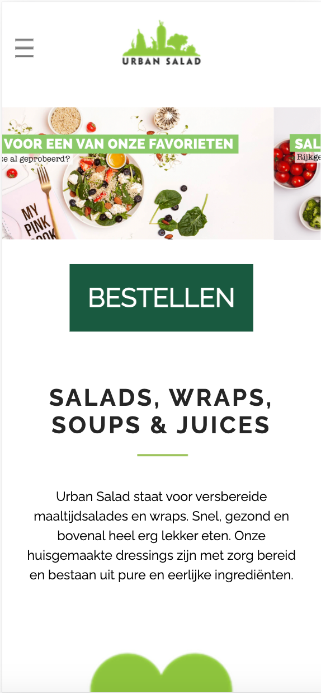
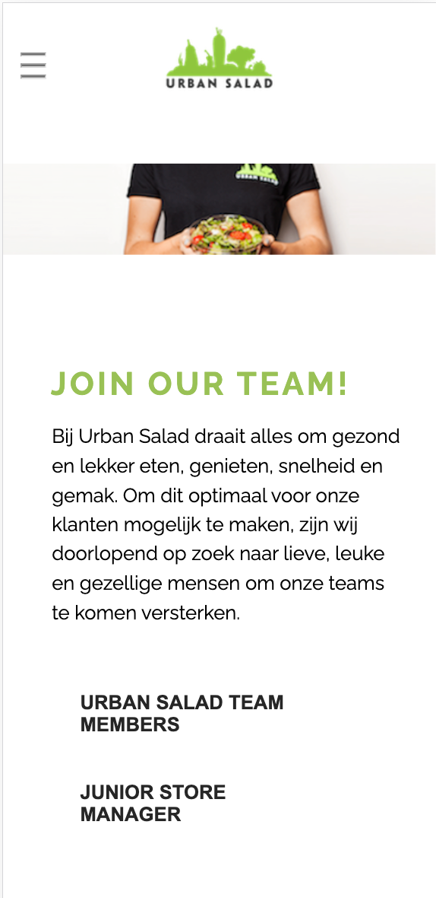

# Procesverslag
Markdown is een simpele manier om HTML te schrijven.  
Markdown cheat cheet: [Hulp bij het schrijven van Markdown](https://github.com/adam-p/markdown-here/wiki/Markdown-Cheatsheet).

Nb. De standaardstructuur en de spartaanse opmaak van de README.md zijn helemaal prima. Het gaat om de inhoud van je procesverslag. Besteedt de tijd voor pracht en praal aan je website.

Nb. Door *open* toe te voegen aan een *details* element kun je deze standaard open zetten. Fijn om dat steeds voor de relevante stuk(ken) te doen.

## Jij

  
uitwerken voor kick-off werkgroep

  ### Auteur:
  Nina Terpstra

  #### Je startniveau:
  Blauw

  #### Je focus:
  responsive 
 

## Je website

  
uitwerken voor kick-off werkgroep

  ### Je opdracht:
  https://www.urbansalad.nl/

  #### Screenshot(s) van de eerste pagina (small screen): 
  Startpagina
  

  #### Screenshot(s) van de tweede pagina (small screen):
  "Kom werken"-pagina
  
 

## Toegankelijkheidstest 1/2 (week 1)

  
uitwerken na test in 2e werkgroep

  ### Bevindingen
  Lijst met je bevindingen die in de test naar voren kwamen:
  De website die ik heb gekozen, is redelijk goed gemaakt voor een Voice Over. Alles wordt goed uitgesproken, alleen een aantal 
  afbeeldingen zijn niet goed omschreven. Ook is er gebruik gemaakt van een duidelijke taal, zonder bijvoorbeeld metaforen. Wel komen er een aantal onderdelen niet voor in de Voice-over die je wel op de site ziet.

## Breakdownschets (week 1)

  
uitwerken na afloop 3e werkgroep

  ### de hele pagina: 
  

## Voortgang 1 (week 2)

  
uitwerken voor 1e voortgang

  ### Stand van zaken
  Ik wist al welke site ik wilde gaan doen, namelijk die van mijn werk. Aangezien daar nog heel veel aan verbeterd kan worden. Alleen 
  alleen had ik wel moeite met Github. Voor mij is het totaal niet logisch en ook met de uitleg er naast was het moeilijk. Daarbij kwam 
  mijn site maar niet online.

  ### Agenda voor meeting
  samen met je groepje opstellen

  | student 1      | student 2          | student 3    | student 4        |
  | Ik heb nog geen| ik twijfel nog     | ik ben wel al| Ik weet welke    |
  | goede site     | tussen twee sites  | begonnen met | site ik wil gaan |
  | gevonden       | en moet mijn github| mijn site,   | doen maar ik loop|
  |                | nog aanmaken       | maar niet ver| vast met github  |
                                          

  ### Verslag van meeting
  hier na afloop snel de uitkomsten van de meeting vastleggen

  - Een aantal hebben nog geen site
  - Een student loopt vast met github maar wordt geholpen door medestudent
  - Een student twijfelde nog maar heeft samen met een andere student een site gekozen
  - De studenten moeten wel harder gaan werken om op schema te blijven
    

## Voortgang 2 (week 3)

  
uitwerken voor 2e voortgang

  ### Stand van zaken
  Ik heb de basis al, maar de moeilijke dingen als een automatische slider met afbeeldingen en een hamburgermenu lukt mij niet. Ik ben 
  er al erg lang mee bezig maar kom er niet uit, ook niet met uitlegfilmpjes op bijvoorbeeld Youtube of uitleg op sites als w3schools en 
  css-tricks.

  ### Agenda voor meeting
  samen met je groepje opstellen

  | student 1      | student 2          | student 3    | student 4        |
  | het lukt mij   | een hamburger-menu | het gaat     | bij lukken de    |
  | niet om een    | wil mij niet lukken| eigenlijk wel| dropdowns en de  |
  | slider te maken| en mij lukt de     | goed, maar ik| slider ook niet  |
  |                | slider ook niet    | ben nog niet |                  |
                                          ver

De slider is nu een hele lange afbeelding die van links naar rechts gaat en ook niet stopt. Naast dat hij niet stopt, weet ik dat één lange afbeelding niet de juiste manier is en wil ik dat de slider het doen met drie verschillende afbeeldingen.

  ### Verslag van meeting
  hier na afloop snel de uitkomsten van de meeting vastleggen

  - De meeste hebben de basis al van de website
  - Er wordt veel tegen de complexere items aangelopen
  - Zo wil het maken van een slider bij niemand lukken
  - Een hamburger menu en dropdowns willen sommige ook niet lukken
  - Studenten uit de groep kunnen elkaar wel helpen bij moeilijkheden want anderen begrijpen wel de hamburger menu's en dropdowns

## Toegankelijkheidstest 2/2 (week 4)

  
uitwerken na test in 9e werkgroep

  ### Bevindingen
  Lijst met je bevindingen die in de test naar voren kwamen (geef ook aan wat er verbeterd is):
  Naast dat er in plaats van 2 fouten en 95 waarschuwingen er nu alleen nog 8 waarschuwingen over zijn en dus nu de HTML wel gevalideerd 
  wordt, zijn er ook een aantal andere dingen uit de test gekomen die anders zijn. Zo worden nu alle elementen die je ziet op de pagina 
  benoemd door de Voice-Over en dat ook met een duidelijke benaming. Ook zijn de knoppen en linkjes nu beter klikbaar, zo was de 
  hamburger-menu op de originele site heel klein en heb ik die een stuk groter gemaakt. Het contrast in kleuren was al erg goed, maar 
  heb ik nog wat verbeterd door de knoppen die bijna zwart waren gewoon zwart te maken. Ook heb ik tussen een aantal items wat meer 
  ruimte gezet om een duidelijk onderscheid te krijgen. In de originele site had je ook minimaal 3 h1's per pagina en dat heb ik terug       gebracht naar 1 h1 per pagina. Ook werden eerst voor alle links button-elementen gebruikt, die heb ik bij de juiste veranderd in a- 
  elementen. En hoe er in de mobiele versie van de site geen slider stond, heb ik die in mijn site wel ook voor de mobiele gebruikers 
  zichtbaar gemaakt.

## Voortgang 3 (week 4)

  
uitwerken voor 3e voortgang

  ### Stand van zaken
  Ik loop nog steeds vast met de slider en een grote grid, maar verder zijn de eerste en tweede pagina nu wel af voor de mobiele   
  gebruikers. Ik ben begonnen met het responsive maken en een heleboel onderdelen gingen eigenlijk al goed mee. Ik ben nu veel met de 
  "@media" bezig en tot nu toe lukt dat erg goed.

  
  
  ### Agenda voor meeting
  samen met je groepje opstellen

  | student 1      | student 2          | student 3    | student 4        |
  | Ik loop tegen  | Ik ben begonnen met|Ik heb mijn   | Ik ben al        |
  | de slider en   | het responsive     | eerste pagina| begonnen aan de  |
  | grid aan, maar | maken maar kom er  | responsive   | tweede pagina    |
  | verder ben ik  | niet goed uit      | gemaakt maar | responsive te    |
    klaar om                              moet nog een   maken maar de 1e
    responsive te                         hele pagina    is nog niet goed 
    maken                                 maken          gelukt

  ### Verslag van meeting
  hier na afloop snel de uitkomsten van de meeting vastleggen

  - Iedereen loopt ongeveer wel gelijk en op schema
  - De studenten hebben moeite met verschillende onderdelen
  - De studenten kunnen elkaar helpen en het elkaar goed uitleggen
  - Een aantal hebben moeite met het responsive maken en twijfelen toch om het niet responsive te maken
  - Een iemand moet nog een hele tweede pagina maken

## Eindgesprek (week 5)

  
uitwerken voor eindgesprek

  ### Je uitkomst - karakteristiek screenshots:
  
    
      
        
          
            
              
                
                       
                              
                                      
                                              
                                                      

  ### Dit ging goed/Heb ik geleerd: 
  Korte omschrijving met plaatjes

  Ik heb sowieso veel geleerd op het gebied van responsive maken en het gebruiken van een grid. Ik weet nu ook hoe ik met flex-wrap nu   
  moet werpen en de basis respinsive maken ging erg snel en goed. Ook een hamburger menu ging aan de hand van een video erg gemakkelijk en 
  daarbij begreep ik (sowieso bij alles wat ik deed) goed wat ik aan het doen was.

  ### Dit was lastig/Is niet gelukt:
  Korte omschrijving met plaatjes

  Ik heb geleerd hoe een grid werkt, maar die ik moest maken vond ik erg ingewikkeld. Vooral om de grid responsive te maken lukte niet     
  heel goed, zo is hij wel goed op desktop formaat en iphone 12 pro formaat maar niet bij alle maten er tussen in of juist er buiten.

  

## Bronnenlijst

  
continu bijhouden terwijl je werkt

  Nb. Wees specifiek ('css-tricks' als bron is bijv. niet specifiek genoeg). 
  Nb. ChatGpT en andere AI horen er ook bij.
  Nb. Vermeld de bronnen ook in je code.

  1. https://www.youtube.com/watch?v=flItyHiDm7E voor het hamburger menu
  2. https://css-tricks.com/css-only-carousel/ voor de slider
  3. https://cssgridgarden.com/#nl voor de grids

